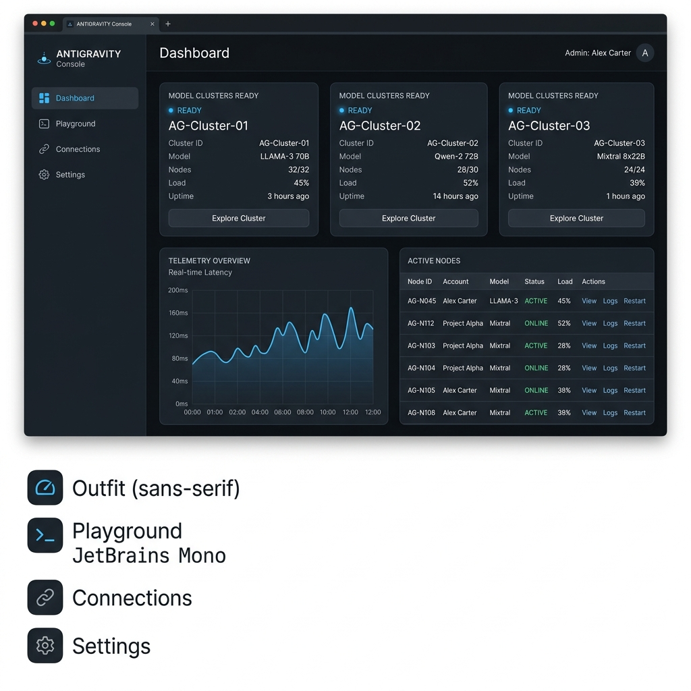

# Antigravity Proxy (Rust)



A high-performance Rust port of the **Antigravity Proxy** (originally built in Bun/TypeScript). It translates OpenAI-compatible chat completion payload requests into Google Cloud PA API calls (`v1internal:streamGenerateContent`) with advanced account rotation, capabilities classification, response streaming, loop interception, and credit quota tracking.

## 🚀 Key Features

*   **OpenAI to Google PA Translation**: Emulates `/v1/chat/completions` (streaming & non-streaming) translating to Google's internal APIs.
*   **Intelligent Account Rotation**: Double-checked concurrent token refreshing, health-scoring, sticky sessions, and cooldown management across `cli` and `sandbox` account pools.
*   **Search Interception & Synthetic Grounding**: Intercepts Google Search tool calls to execute factual queries dynamically or inject context before main execution.
*   **Infinite Loop Detection**: Fast pattern window scan detector to stop repetitive cycles early and seamlessly resume generation.
*   **Static Admin Dashboard**: Real-time credit monitoring, account diagnostics, strategy adjustments, and console output visualization.
*   **Password Authorization**: Access control using `PROXY_PASSWORD` or configuration settings.

## 📊 Performance & Codebase Benchmarks

The port from Bun/TypeScript to Rust achieved a massive optimization and consolidation footprint:

### ⚡ Real-World Metrics (Measured on Termux)

| Metric | Original Bun/TypeScript | Ported Rust (Cargo) | Change |
|---|---|---|---|
| **Source Directory Files** | 30 files (nested across 5 folders) | **6 files** (flat in `src/`) | **-80% file reduction** |
| **Disk/Deployment Size** | ~120 - 150 MB (Bun runtime + 30MB `node_modules`) | **13 MB** (Fully self-contained standalone binary) | **~90% smaller footprint** |
| **Memory Usage (Idle RSS)** | ~48 MB RAM | **~19 MB RAM** | **~60% RAM reduction** |
| **HTTP Request Latency** | ~7.7 ms | **~2.6 ms** | **3x faster response times** |

*Note: Latency benchmark was performed over 50 consecutive local loopback requests to the `/health` endpoint to isolate runtime processing overhead from network lag.*

### 📂 Simplified Architecture

All complex logic—including token rotation, PKCE verifiers, synthetic search routing, and custom SSE framing—was simplified from multiple scattered files into 5 cohesive Rust modules (`config`, `auth`, `utils`, `quota`, `lib`) managed by a single entry point (`main`).

---

## 🛠️ Prerequisites

*   Rust & Cargo installed (edition 2024)
*   Google Cloud OAuth credential setups

---

## ⚙️ Setup & Configuration

1. Place your configuration settings in `config.json` inside the root folder.
2. Place your target accounts configuration in `antigravity-accounts.json` inside the root folder.

Example `.env` environment variables:
```bash
PORT=3000
PROXY_PASSWORD="your_password"
```

---

## 🏃 Getting Started

### Start the Server (Dev mode)
```bash
PORT=3000 PROXY_PASSWORD="your_password" cargo run
```

### Start the Server (Release mode)
```bash
PORT=3000 PROXY_PASSWORD="your_password" cargo run --release
```

The admin interface will be available at `http://localhost:3000/frontend/`.

---

## 🧪 Testing
Run the unit test suite:
```bash
cargo test
```
